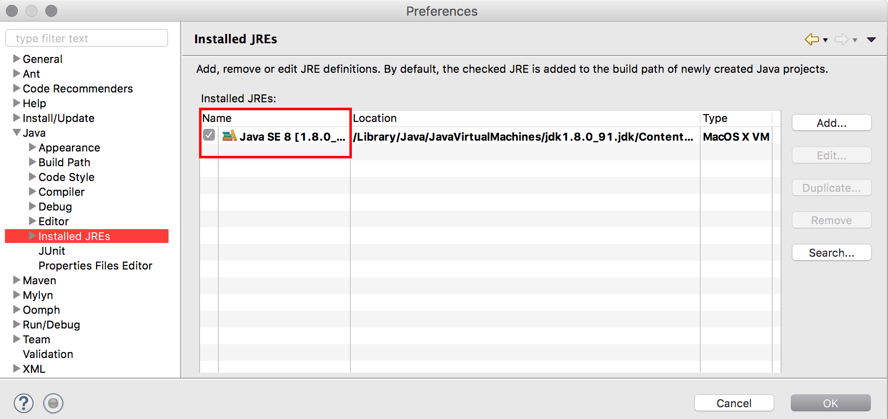
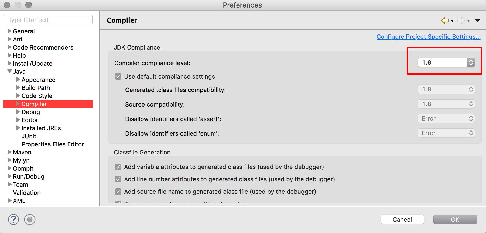

## Eclipse에 Scene builder 설정

1. JDK 버전 확인

2. e(fx)clipse 설치
 - e(fx)clipse 설치 주소 : [http://download.eclipse.org/efxclipse/updates-released/2.1.0/site](http://download.eclipse.org/efxclipse/updates-released/2.1.0/site)
 
 - 설치 후 eclipse 재시작

3. JavaFX Scenne Builder 설치
 - [http://www.oracle.com/technetwork/java/javafxscenebuilder-1x-archive-2199384.html](http://www.oracle.com/technetwork/java/javafxscenebuilder-1x-archive-2199384.html)
 - 