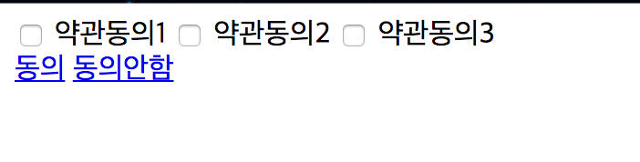
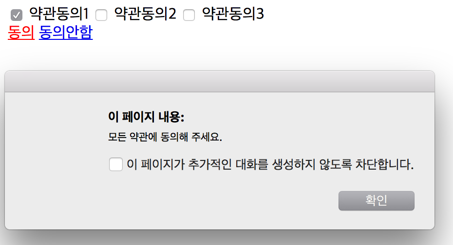
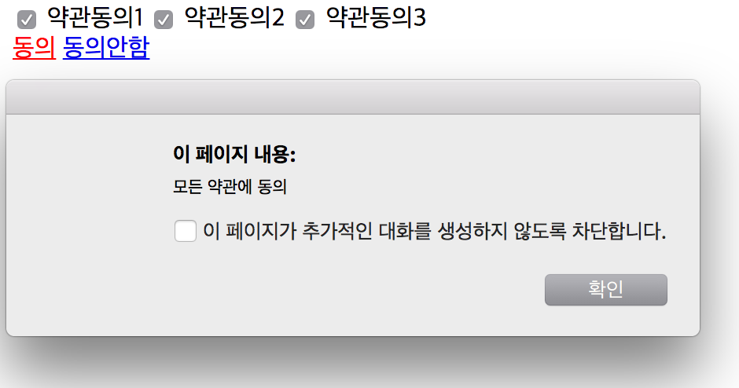

##JavaScript checkbox 선택 확인
- checkbox 속성
 - name : checkbox 이름
 - length : 같은 이름의 checkbox 수
 - checked : checkbox의 check 여부 true, false
 - value : check

###JavaScript를 이용해서 checkbox 선택 확인하기


```javascript
<!DOCTYPE html>
<html>
  <head>
    <meta charset="utf-8">
    <title>checkBox</title>
    <script type="text/javascript">
        function agree() {
            var chkbox = document.getElementsByName('agree');
            var chk = false;
            for(var i=0 ; i<chkbox.length ; i++) {
                if(chkbox[i].checked) {
                  chk = true;
                } else {
                  chk = false;
                }
            }

            if(!chk) {
              alert("모든 약관에 동의해 주세요.");
              return false;
            } else {
              alert("모든 약관에 동의")
            }
        }
    </script>
  </head>
  <body>
      <form action="">
          <input type="checkbox" name="agree" id="chk1"> 약관동의1
          <input type="checkbox" name="agree" id="chk2"> 약관동의2
          <input type="checkbox" name="agree" id="chk3"> 약관동의3
      </form>

      <a href="javascript:agree();">동의</a>
      <a href="#">동의안함</a>
  </body>
</html>
```
###결과


