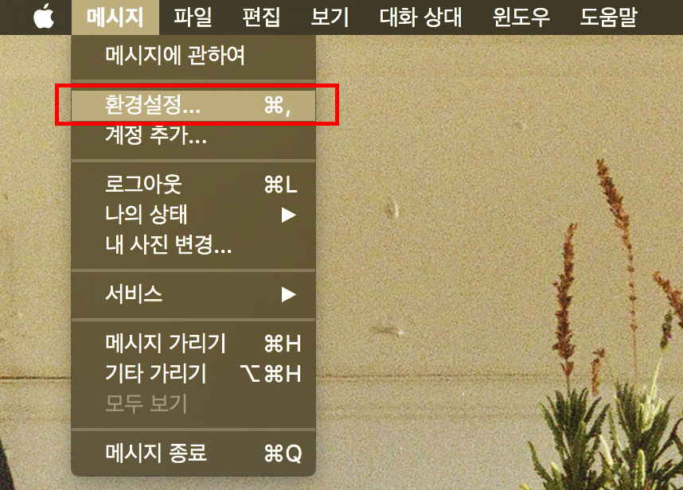

##맥(Mac)에서 아이폰(iPhone) SMS(문자메시지) 주고 받기
이 글은 **맥(Mac)**을 사용하면서 **아이폰(iPhone)**을 사용하시는 분들에게 해당하는 내용입니다.

기본적으로 iMessage는 애플계정을 사용한다면 **맥**과 **아이폰**에서 동기화하여 사용할 수 있습니다.
그리고 SMS(문자메시지)도 추가 설정만 한다면 **맥**과 **아이폰**에서 동기화하여 사용이 가능합니다.

###방법
1. **맥**과 **아이폰** 같은 계정 사용을 확인
 - 맥에서 메시지 Apple ID 확인(메시지앱 - 메뉴 - 환경설정) 
 
  

 - 아이폰에서 메시지 Apple ID 확인(설정 - 메시지 - 발신 및 수신) 
  

2. 맥과 아이폰이 같은 계정 사용 중이라면 아이폰에서 **'설정-메시지-문자 메시지 전달'** 선택
 - '문자 메시지 전달'에서 SMS 문자 받을 기기 선택 
  

3. 맥에서 **'메시지' 앱**에 나타난 숫자를 아이폰에 입력 후 **'허용'**버튼 선택 
  

4. 설정이 완료되면 맥에서 SMS 문자메시지를 주고 받기가 가능